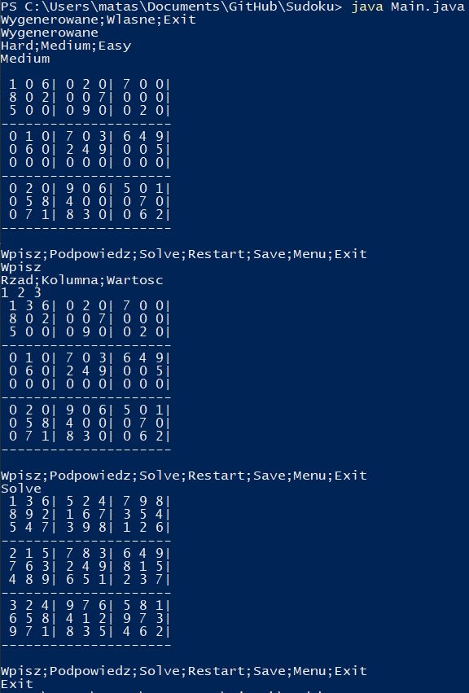
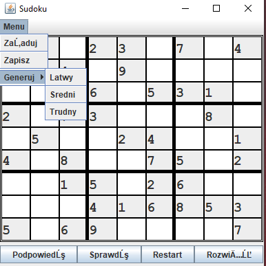
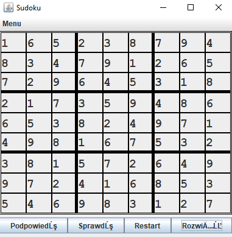

# Sudoku
Sudoku - solver i generator - projekt wykonany w ramach przedmiotu Podstawy programowania 2.

Program do rozwiązywania sudoku z możliwością zapisu oraz wczytania postępu, możliwość uzyskania podpowiedzi.

Main.java - sudoku w command line.

MainGui.java - sudoku z interfejsem graficzynm

